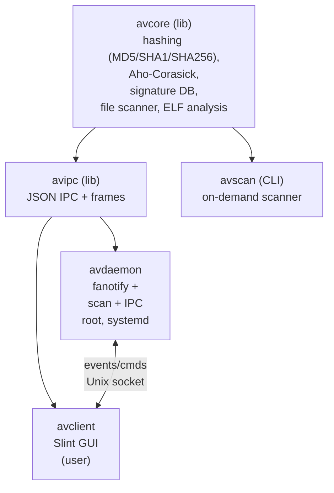

# Linux Antivirus

Модульный антивирус для Linux на C++.

Сочетает **статический анализ файлов** (хэш- и байт-сигнатуры, разбор ELF) и
**динамический мониторинг поведения** (перехват обращений к файлам и запусков
через `fanotify`) с привилегированным сервисом и графическим клиентом.

## Архитектура

Система разделена на три модуля. Вся тестируемая логика вынесена
в библиотеку `avcore`, а ввод-вывод и привилегированные
операции изолированы в `avdaemon`.



| Модуль | Каталог | Роль | Привилегии |
|--------|---------|------|-----------|
| `avcore` | `libs/avcore` | Статическая библиотека: алгоритмы и движок сканирования. Полностью покрыта тестами. | нет |
| `avipc` | `libs/avipc` | Реализация IPC для взаимодействия модулей | нет |
| `avdaemon` | `daemon` | Сканирующий демон антивируса. Поставляется как systemd-юнит. | root / `CAP_SYS_ADMIN` |
| `avclient` | `client` | Графический клиент на Slint | пользователь |
| `avscan` | `apps/avscan` | CLI on-demand сканер | нет |

## Возможности

- База сигнатур: хэши (MD5/SHA1/SHA256), байтовые сигнатуры с использованием алгоритма **Ахо-Корасик**
- Сканирование правилами **YARA**
- Статический анализ **ELF** (ELFIO): тип, разрядность, архитектура, секции,
  обнаружение W^X-сегментов (одновременно записываемых и исполняемых)
- Рекурсивный мониторинг каталогов в реальном времени через `fanotify`
  (с блокировкой доступа) + `inotify` для динамического отслеживания появления и
  удаления подкаталогов
- Поведенческий мониторинг процессов через **eBPF**: перехват `execve`,
  `fork`/`vfork`/`clone`, `ptrace`, `mmap` с `PROT_EXEC`; запускаемые файлы
  сканируются на лету
- **Карантин**: изоляция заражённых файлов в защищённое хранилище с возможностью
  восстановления; авто-карантин обнаруженных угроз
- Графический клиент на **Slint** с уведомлениями о статусе защиты

## Зависимости

- Компилятор C++20, CMake >= 3.24, Ninja
- Boost >= 1.74
- Для сборки клиента: Rust для сборки Slint
- Системные: `libmagic`, `libelf`. Опционально: `libyara` (для сканирования YARA-правилами),
  `libbpf` + `clang` (для использования eBPF).
- Загружаются автоматически: **doctest**, **ELFIO**,
  **Slint**.

## Сборка

```bash
# Только библиотека, CLI и тесты:
cmake -S . -B build -G Ninja -DAV_BUILD_DAEMON=OFF -DAV_BUILD_CLIENT=OFF
cmake --build build
ctest --test-dir build --output-on-failure

# Полная сборка:
cmake -S . -B build -G Ninja
cmake --build build
```

### Опции CMake

| Опция | По умолчанию | Назначение |
|-------|--------------|-----------|
| `AV_BUILD_TESTS` | ON | Сборка тестов doctest |
| `AV_BUILD_DAEMON` | ON | Сборка демона |
| `AV_BUILD_CLIENT` | ON | Сборка GUI-клиента |
| `AV_ENABLE_YARA` | ON | Поддержка правил YARA (нужна libyara) |
| `AV_ENABLE_EBPF` | OFF | Поддержка eBPF (нужны libbpf + clang) |
| `AV_WARNINGS_AS_ERRORS` | OFF | `-Werror` |

## Использование

### CLI-сканер

```bash
./build/apps/avscan --db data/signatures.db --elf /path/to/scan ...
```

### Запуск демона и GUI

Чтобы непривилегированный клиент мог подключиться к сокету демона, запущенного от root,
запускайте демон с `--socket-group <группа>`:
демон выставит сокету эту группу и режим `0660`. Пользователь должен входить в
указанную группу.

```bash
sudo ./build/daemon/avdaemon --socket /run/avdaemon.sock --db data/signatures.db \
     --socket-group "$(id -gn)"
./build/client/avclient --socket /run/avdaemon.sock
```

Альтернативные права на сокет можно указать с помощью опции `--socket-mode`: например, `--socket-mode 0666`.

#### Мониторинг

Для включения мониторинга используйте опцию `--watch <DIRECTORY>`.
`--watch` следит за каталогом **рекурсивно**:
fanotify-метки ставятся на каждый каталог поддерева, а параллельный **inotify** отслеживает
появление/удаление подкаталогов после старта и на лету синхронизирует набор
меток.

```bash
sudo ./build/daemon/avdaemon --socket /run/avdaemon.sock --db data/signatures.db \
     --watch /home/user/Downloads
```

#### Блокирование операций с файлами

Для блокирования операций с файлами, помеченными как вредоносные,
можно использовать опцию `--enforce`. Область работы опции ограничена наблюдаемым каталогом,
но если демон затормозит или упадёт, открытия файлов **в этом каталоге** будут ждать его.

```
sudo ./build/daemon/avdaemon --watch /home/user/Downloads --enforce
```

### Карантин

Опция `--quarantine <dir>` включает карантин: обнаруженные в реальном времени
угрозы автоматически изолируются в `<dir>` (хранилище с правами `0700`, у файла
снимаются права), а метаданные позволяют восстановить файл. Сам карантин исключен
из сканирования во избежание рекурсивного карантина файлов.

```bash
sudo ./build/daemon/avdaemon --socket /run/avdaemon.sock --db data/signatures.db \
     --watch /home/user/Downloads --quarantine /var/lib/avdaemon/quarantine
```

### Поведенческий мониторинг (eBPF)

При использовании опции `--syscalls` запускаемые бинарные файлы статически
сканируются (и отправляются в карантин, если включён `--quarantine`).

```bash
sudo ./build/daemon/avdaemon --socket /run/avdaemon.sock --db data/signatures.db \
     --syscalls --quarantine /var/lib/avdaemon/quarantine
```

### Клиент

```bash
./build/client/avclient --socket /run/avdaemon.sock
```

### База сигнатур

База подключается с использованием опции `--db <FILE>`.

Одна сигнатура на строку, `#` - комментарий. См. `data/signatures.db`:

```
hash:<hex digest>:<имя угрозы>     # MD5/SHA1/SHA256 всего файла
hex:<hex bytes>:<имя угрозы>       # байтовый паттерн в любом месте файла
```

### Правила YARA

YARA-правила (как один файл, так и директория с правилами) передаётся в опции `--yara <PATH>`. Правила проверяются после хэш- и байт-сигнатур; имя
сработавшего правила становится именем угрозы. Пример правила - `data/rules.yar`.

```bash
./build/apps/avscan --yara data/rules.yar /path/to/scan
sudo ./build/daemon/avdaemon --db data/signatures.db --yara data/rules.yar --watch /srv/inbox
```

## Тесты

Для тестирования использована библиотека **doctest**. Тесты запускаются через `ctest`:

```bash
ctest --test-dir build
```
